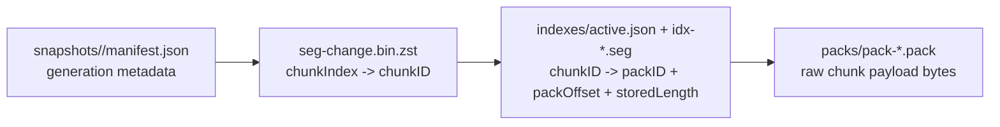
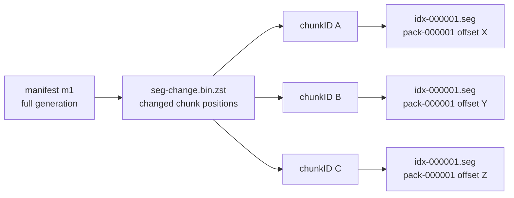
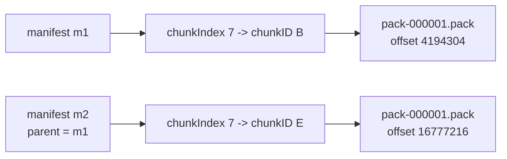
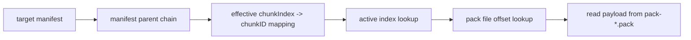
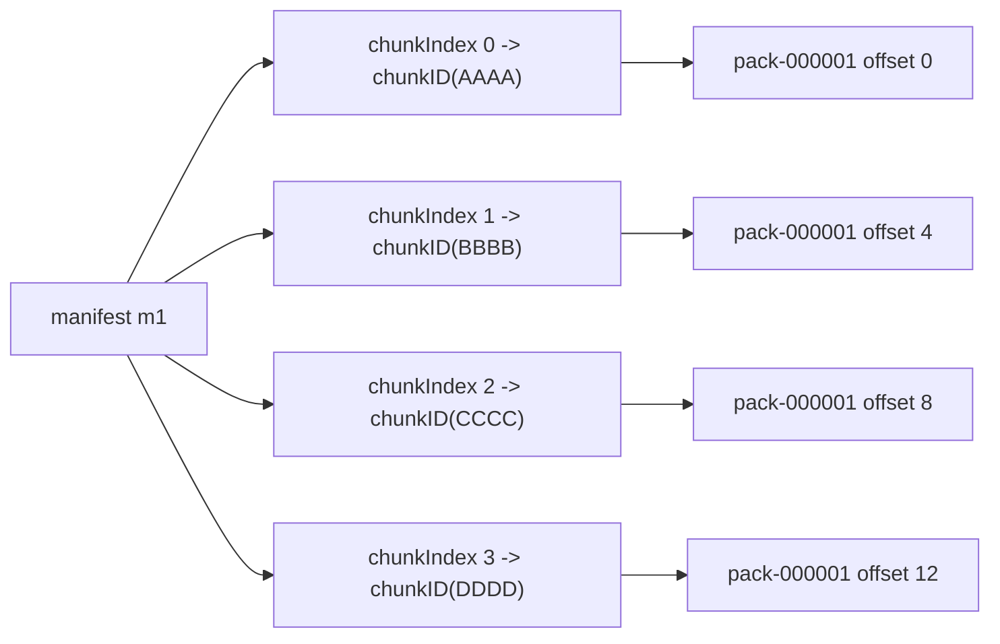
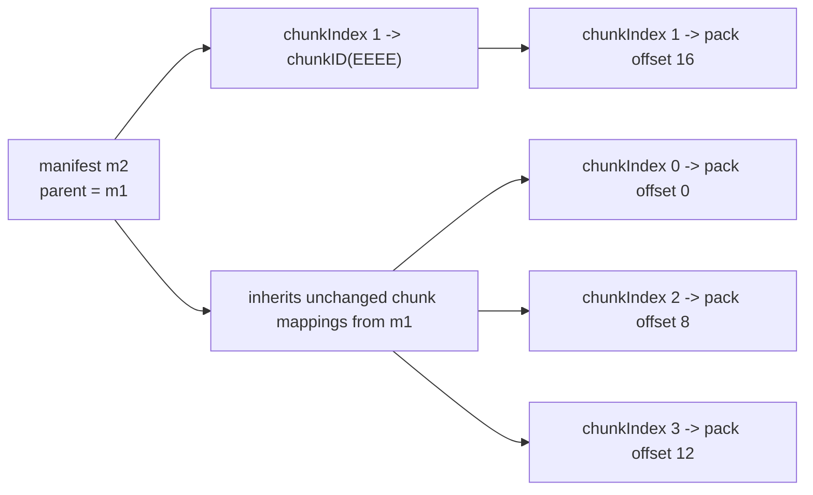

# Snaplane CAS Storage Overview

This note explains how Snaplane CAS mode stores backup payloads on disk and how a later generation points at newly written chunk data without rewriting older generations.

## What Snaplane Stores

In CAS mode, one repository exists per source PVC:

```text
/var/backup/<namespace>/<pvc>/repo/
```

That repository separates three concerns:

- snapshot generation metadata
- chunk location metadata
- chunk payload bytes



## Repository Tree

```text
repo/
├── repo.json
├── refs/
│   └── latest.txt
├── snapshots/
│   └── <manifest-id>/
│       ├── manifest.json
│       ├── seg-alloc.bin.zst
│       └── seg-change.bin.zst
├── packs/
│   ├── pack-000001.pack
│   └── pack-000001.pidx
├── indexes/
│   ├── active.json
│   └── segments/
│       └── idx-000001.seg
├── locks/
└── tmp/
```

## Roles

- `manifest.json`
  - identifies one backup generation
  - stores `manifestID`, `parentManifestID`, volume size, chunk size, and stats
- `seg-change.bin.zst`
  - stores which logical `chunkIndex` positions changed in that generation
  - each change record points at a `chunkID` or marks the chunk `freed`
- `idx-*.seg`
  - stores the global mapping from `chunkID` to a location in a pack file
- `pack-*.pack`
  - stores actual chunk payload bytes
- `pack-*.pidx`
  - stores per-pack offsets for the chunk payloads written into that pack

## Full Backup

During a full backup, Snaplane computes chunk payloads from the backup input stream and writes any new chunk payload bytes into a pack file.

The first generation has no parent:



## Incremental Backup

During an incremental backup, Snaplane writes only changed logical chunk positions into the new generation metadata.

If a changed chunk produces a new `chunkID`, Snaplane appends the new payload to a pack and publishes a new index segment.
Older payload bytes remain in the repository so earlier generations continue to restore correctly.



The important behavior is:

- old generations keep pointing at old payload bytes
- new generations point at newly appended payload bytes
- restore resolves the manifest chain, then uses the active index to locate each final chunk payload

## Restore Resolution

Restore does not read the pack file directly from the manifest.
It resolves in steps:



## Small Worked Example

The real implementation uses `4 MiB` fixed-size chunks.
The example below uses `4 byte` chunks for readability.

Initial full backup:

```text
chunkIndex 0 = AAAA
chunkIndex 1 = BBBB
chunkIndex 2 = CCCC
chunkIndex 3 = DDDD
```

Resulting pack:

```text
pack-000001.pack
0..4    AAAA
4..8    BBBB
8..12   CCCC
12..16  DDDD
```



Now assume only `chunkIndex 1` changes:

```text
BBBB -> EEEE
```

Snaplane appends the new payload instead of rewriting the old bytes:

```text
pack-000001.pack
0..4    AAAA
4..8    BBBB
8..12   CCCC
12..16  DDDD
16..20  EEEE
```



Effective mapping for `m2`:

```text
chunkIndex 0 -> pack-000001 offset 0
chunkIndex 1 -> pack-000001 offset 16
chunkIndex 2 -> pack-000001 offset 8
chunkIndex 3 -> pack-000001 offset 12
```

## Key Point

If one byte changes inside a real `4 MiB` chunk, Snaplane stores a new `4 MiB` chunk payload for that logical position and points the new generation at the newly appended payload.
The old payload stays in the repository until later GC or compaction rewrites the pack and index files.
